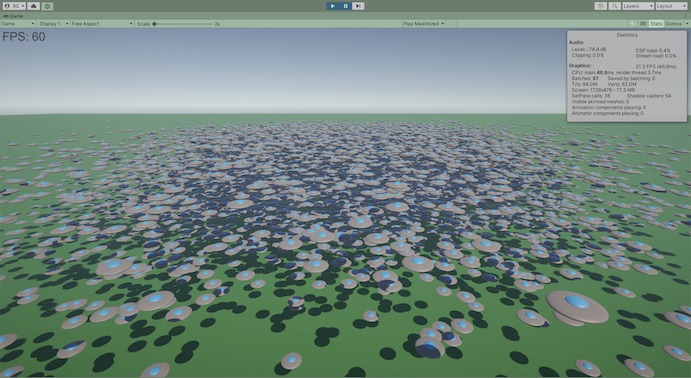

# unity-ecs-ufo-demo

Demo Unity ECS project, spawning simple non-physics gameobjects/entities using both regular MonoBehaviour and ECS

Based on documentation and examples in https://docs.unity3d.com/Packages/com.unity.entities@latest

## Features

1. Open `Scenes/MB_Scene` for the MonoBehaviour demo
1. Open `Scenes/ECS_Scene` for the ECS demo
   - Add `USE_JOBS` conditional define for the jobified system, although in practice doesn't make much difference, given system is so simple
